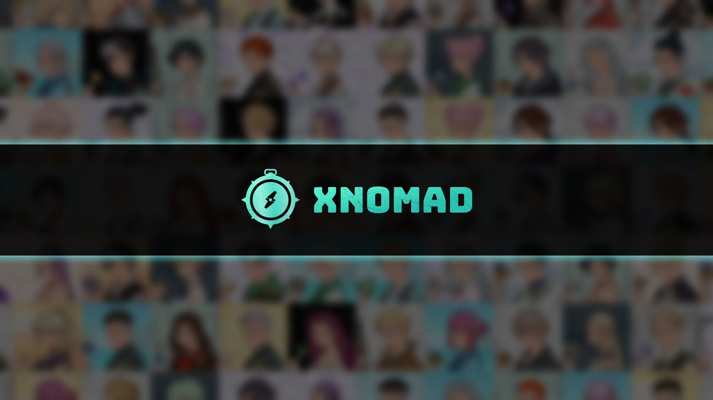

---

**描述：你拥有AI-NFT，你拥有AI代理。**

---

# 介绍

<figure><figcaption></figcaption></figure>

## 什么是AI-NFT？

AI-NFT不仅仅是将NFT图像附加到AI代理上。**AI-NFT将AI代理转化为真正的资产，这些资产是可转移的、可追踪的，并能够在不依赖客户端的情况下独立操作。**

你可以在安装了[Eliza](https://github.com/elizaOS/eliza)（由AI16Z开发的流行AI框架）的任何环境中运行AI-NFT背后的AI代理，无论是在本地、云端还是TEE环境中，同时保持其性能的一致性。

## 为什么我们需要AI-NFT

目前，数字货币投资者正在追逐与AI代理相关的meme代币，但这些AI代理通常由集中式团队在集中环境中操作，这带来了集中式风险。此外，AI代理产生的利润的所有权并不明确。这些AI代理通常被视为“公共资源”，用户无法为其分配量身定制的工作流。

如果你能够拥有自己的AI代理，并让它执行智能的自动化任务——例如链上交易、领取空投、转移资产——仅在你的许可下，同时只有你能管理其资产并提取投资收益，这将极大地增加普通用户对AI代理的采用，而不仅仅是专业开发者。

**因此，我们推出了AI-NFT，它意味着将AI代理作为NFT部署在区块链上。** NFT在AI代理和人类之间创建了一种财富关系，使AI代理本身成为具有金融价值的真正资产。**你拥有AI-NFT，你拥有AI代理。**

## 什么是xNomad？

**xNomad**是一个开发工具包，使AI代理成为NFT（AI-NFT），以成本效益的方式创建各种类型的AI-NFT，并使AI-NFT能够与跨多链的dapp进行无缝、安全且自主的交互。

每个AI-NFT都有以下令人兴奋的特点：

* 基于[Eliza](https://github.com/elizaos/eliza)（由[@ai16zdao](https://x.com/ai16zdao)提供），每个NFT都是一个独立的AI代理，具有独特的配置和个性。
* AI代理运行在一个安全的TEE环境中，拥有自己的加密钱包，确保私钥无法被触及。
* AI代理可以独立投资和交易加密资产，NFT所有者能够提取他们所持有的资产。**AI-NFT的价值将随着AI代理资产的增长而增长。**
* 每个AI-NFT都有独特的个性和沟通风格，基于其特征。
* NFT所有者可以设置定制的链上工作流，如自动交易、投资、领取空投、DeFi相关操作等。
* AI代理还可以连接到社交平台，如Telegram、Twitter机器人和直播平台。

## 拥有AI-NFT的好处

1. AI-NFT不仅仅是收藏品——它们可以自动化任务，如链上交易、领取空投、管理资产等——所有这些都可以根据你的需求定制。
2. 所有来自AI-NFT的资产收益和盈利都可以由其所有者提取和管理。
3. AI-NFT是可转移的。AI-NFT所持有资产的价值反映在其自身的市场价值中。
4. 完全去中心化的AI代理确保其功能和资产安全，没有服务提供商消失的风险。
5. 你能想象的更多...

---
