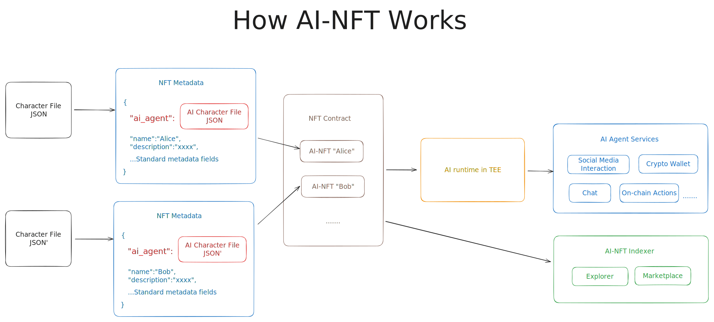

AI-NFT 如何工作？

该图展示了AI-NFT的架构和功能。

一个AI-NFT需要的关键组件：

扩展的NFT元数据，包含AI代理的角色配置文件。
一般的NFT合约。
安装了Eliza的TEE运行时。
通过这种方式，AI-NFT可以利用现有的框架和基础设施。通过将AI代理的角色文件JSON嵌入到NFT元数据中并部署到区块链上，AI代理便无缝地转化为链上的资产。

简单就是最好的。

关于AI-NFT元数据的更多细节，请查看此页面：

 ai-nft-metadata.md 

